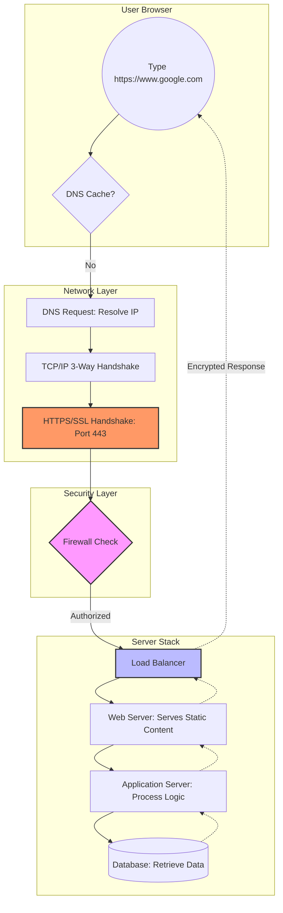

# Task 1: The Infrastructure Diagram (1-what_happen_when_diagram)

This file should contain the **URL** to your hosted diagram. Below is a logic map you can use to build your visual in tools like `diagrams.net` or `Mermaid.js`.

## Mermaid Diagram Structure

